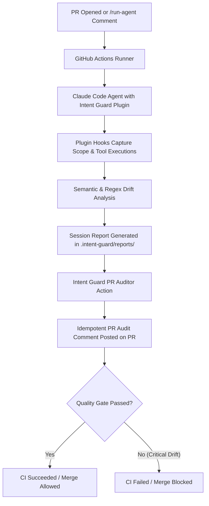

# Running Intent Guard in GitHub Actions & CI/CD

This document explains how to integrate **Intent Guard** into your GitHub Actions pipelines to audit autonomous AI coding agents, enforce safety boundaries, and post drift reports directly to Pull Requests.

---

## 1. Overview & Architecture

When an AI coding agent (such as Claude Code, GitHub Copilot workspace, or an autonomous PR bot) operates on a repository, Intent Guard intercepts user intent and agent actions, comparing what was requested against what was actually touched.



---

## 2. GitHub Token Permissions

To allow the GitHub Action to post and update comments on pull requests, your workflow job must declare write permissions for `pull-requests`:

```yaml
permissions:
  contents: read
  pull-requests: write
```

If your workflow also runs agent tasks that commit or push changes back to the PR branch, add `contents: write`.

---

## 3. Workflow Recipes

### Recipe A: Standalone PR Auditor Action

Use this workflow when agent sessions run during testing, pre-commit, or previous workflow steps that populate `.intent-guard/reports/`. The action reads the reports and idempotently publishes an audit summary to the PR.

Create `.github/workflows/intent-guard-audit.yml`:

```yaml
name: "Intent Guard PR Audit"

on:
  pull_request:
    types: [opened, synchronize, reopened]

permissions:
  contents: read
  pull-requests: write

jobs:
  audit-pr:
    name: Audit Intent Drift
    runs-on: ubuntu-latest
    steps:
      - name: Checkout Code
        uses: actions/checkout@v4

      - name: Run Intent Guard PR Auditor Action
        uses: Gani-23/Intent-core@main # or release tag e.g. @v0.1.0
        with:
          github_token: ${{ secrets.GITHUB_TOKEN }}
          report_dir: ".intent-guard/reports"
```

---

### Recipe B: Running Headless Claude Code with Intent Guard in CI

Use this workflow to run Claude Code autonomously in CI (for example, generating PR review comments, resolving issues, or writing tests) while safeguarding the repository with Intent Guard.

Create `.github/workflows/agent-ci.yml`:

```yaml
name: "Agent CI Execution & Drift Guard"

on:
  pull_request:
    types: [opened, synchronize, reopened]

permissions:
  contents: write
  pull-requests: write

jobs:
  agent-run:
    runs-on: ubuntu-latest
    steps:
      - name: Checkout repository
        uses: actions/checkout@v4

      - name: Set up Python
        uses: actions/setup-python@v5
        with:
          python-version: "3.12"
          cache: "pip"

      - name: Set up Node.js
        uses: actions/setup-node@v4
        with:
          node-version: "20"

      - name: Install Dependencies
        run: |
          npm install -g @anthropic-ai/claude-code
          pip install -e ".[api]"

      - name: Run Agent with Intent Guard Plugin
        env:
          ANTHROPIC_API_KEY: ${{ secrets.ANTHROPIC_API_KEY }}
          # Intent Guard posture
          INTENT_GUARD_MODE: "strict"
          INTENT_GUARD_FAIL_CLOSED: "true"
          # Register local plugin root
          CLAUDE_PLUGIN_ROOT: ${{ github.workspace }}
        run: |
          echo "Running Claude Code under Intent Guard..."
          # Headless invocation example:
          # claude --print "Audit src/ for security vulnerabilities and report findings" || true

      - name: Post Drift Audit to PR
        uses: Gani-23/Intent-core@main
        with:
          github_token: ${{ secrets.GITHUB_TOKEN }}
          report_dir: ".intent-guard/reports"
```

---

### Recipe C: Hard Quality Gate (Block PR on Critical Drift)

If you want the CI check to fail when an agent attempts unauthorized mutations (such as modifying `.env`, dropping tables, or altering files outside the declared prompt scope):

```yaml
      - name: Post Drift Audit to PR
        uses: Gani-23/Intent-core@main
        with:
          github_token: ${{ secrets.GITHUB_TOKEN }}
          report_dir: ".intent-guard/reports"

      - name: Fail CI on Critical Drift Findings
        run: |
          python3 -c "
          from pathlib import Path
          import sys

          reports = list(Path('.intent-guard/reports').glob('*.md'))
          critical = 0
          for r in reports:
              text = r.read_text(encoding='utf-8')
              if 'CRITICAL' in text or 'destructive' in text.lower():
                  critical += 1

          if critical > 0:
              print(f'❌ PR Quality Gate Failed: {critical} critical drift finding(s) detected!')
              sys.exit(1)
          print('✅ PR Quality Gate Passed: No critical drift detected.')
          "
```

---

## 4. Configuration Reference

### Action Inputs (`action.yml`)

| Input | Description | Required | Default |
| :--- | :--- | :--- | :--- |
| `github_token` | `secrets.GITHUB_TOKEN` or a personal access token for posting comments | **Yes** | N/A |
| `pr_number` | Pull request number to comment on (auto-detected from event JSON if omitted) | No | `github.event.pull_request.number` |
| `report_dir` | Directory where session report markdown files are saved | No | `.intent-guard/reports` |
| `api_url` | Central Living Systems Auditor telemetry API URL | No | `""` |
| `api_key` | Central Living Systems Auditor API Key | No | `""` |

### Environment Variables

| Variable | Purpose | Default | Recommended for CI |
| :--- | :--- | :--- | :--- |
| `INTENT_GUARD_MODE` | `observe` (telemetry only) or `strict` (intercept destructive bash commands) | `observe` | `strict` |
| `INTENT_GUARD_FAIL_CLOSED` | When `true`, halts tool execution if scope cannot be verified | `false` | `true` |
| `INTENT_GUARD_RETAIN_EVENTS` | When `true`, archives raw event streams to `.intent-guard/archive/` | `false` | `true` (compliance) |
| `ANTHROPIC_API_KEY` | Key for Claude semantic drift analysis pass | None | Required for LLM pass |
| `OPENAI_API_KEY` | Secondary fallback provider for semantic analysis | None | Optional |
| `GEMINI_API_KEY` | Tertiary fallback provider for semantic analysis | None | Optional |

---

## 5. Security & Fork PR Considerations

- **Fork Pull Requests (`pull_request`)**: Workflows triggered by `pull_request` from a fork do not have access to repository secrets (such as `ANTHROPIC_API_KEY`) and have read-only permissions for `GITHUB_TOKEN`.
- **Using `pull_request_target`**: If you need to post comments on fork PRs, consider using `on: pull_request_target`. However, never check out untrusted fork code directly when running with write tokens without proper validation.
- **Idempotency**: The action searches for `<!-- intent-guard-report-marker -->` in existing comments on the PR and updates the existing comment via GitHub's REST API `PATCH /repos/{owner}/{repo}/issues/comments/{comment_id}`, preventing comment spam across multiple git pushes.
